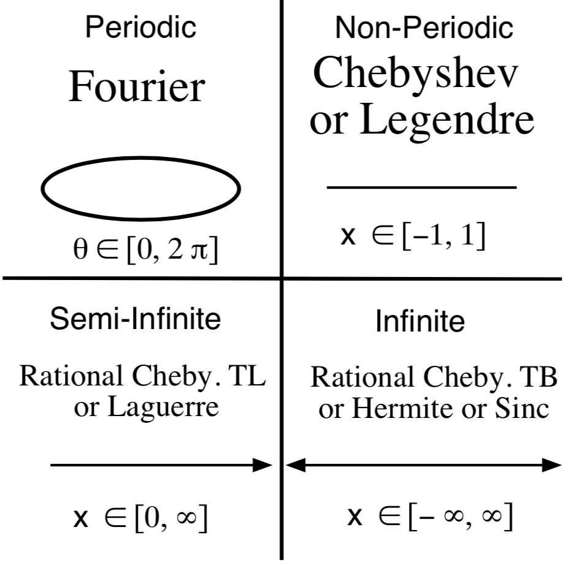
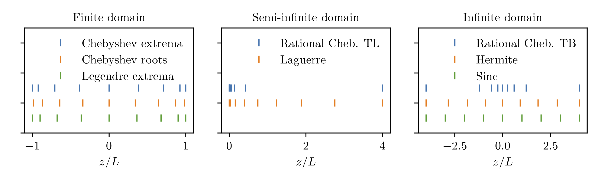

[](https://circleci.com/gh/tberlok/psecas)
[](https://travis-ci.com/tberlok/psecas)
[](https://codecov.io/gh/tberlok/psecas)

<!-- Pressure perturbation for the supersonic Kelvin-Helmholtz instability in
Cartesian and cylindrical geometry
 -->
# Psecas

Psecas (Pseudo-Spectral Eigenvalue Calculator with an Automated Solver)
is a collection of methods for solving eigenvalue problems (EVPs) using
pseudo-spectral methods.

Psecas was introduced [in a MNRAS paper](https://academic.oup.com/mnras/advance-article-abstract/doi/10.1093/mnras/stz379/5308845)
where details on how it all works can be found. The arxiv version of the paper
can be downloaded [here](http://arxiv.org/abs/1902.01403).

If you are here for the Kelvin-Helmholtz instability verification tests presented in Table 2 in the
paper, then you can find more information
[here.](https://github.com/tberlok/psecas/tree/master/examples/kelvin-helmholtz/BerlokPfrommer2019)

### Publications

Psecas was developed for solving the kind of eigenvalue problem that often
arises when a linear stability calculation is performed in astrophysical fluid
dynamics. So far Psecas has been used in the following publications

 - Berlok, T. & Pfrommer, C. (2019). *On the Kelvin-Helmholtz instability with
smooth initial conditions – Linear theory and simulations*,
[MNRAS, 485, 908](https://academic.oup.com/mnras/advance-article-abstract/doi/10.1093/mnras/stz379/5308845)
 - Berlok, T. & Pfrommer, C. (2019). *The impact of magnetic fields on cold streams feeding galaxies*,
 [MNRAS, 489, 3368](https://academic.oup.com/mnras/advance-article-abstract/doi/10.1093/mnras/stz2347/5554001)


### How it works
Pseudo-spectral methods are described
in e.g. the books
[Spectral Methods in Matlab](https://people.maths.ox.ac.uk/trefethen/spectral.html)
by Lloyd N. Trefethen,
[A Practical Guide to Pseudospectral Methods](https://books.google.de/books/about/A_Practical_Guide_to_Pseudospectral_Meth.html?id=IqJoihDba3gC&redir_esc=y)
by Bengt Fornberg and
[Chebyshev and Fourier Spectral Methods](http://depts.washington.edu/ph506/Boyd.pdf)
by John P. Boyd.


In Psecas, the user writes down a linearized set of equations, the eigenvalue problem,
which is automatically discretized on either an infinite, finite or
periodic domain. The resulting EVP can then be solved to a requested precision.

#### Grids
An overview of various grid types is shown on page 11 in the book by
[Boyd](http://depts.washington.edu/ph506/Boyd.pdf).



The code currently has all the grids mentioned on this figure, they
are illustrated with 9 grid points below:


We use ([a fork](https://github.com/tberlok/dmsuite))
of a Python version of

J. A. C. Weidemann and S. C. Reddy, A MATLAB Differentiation Matrix Suite,
ACM Transactions on Mathematical Software, 26, (2000): 465-519.

for creating the Laguerre and Hermite grids. The other grids are created using
the descriptions in the books by
[Boyd](http://depts.washington.edu/ph506/Boyd.pdf) and
[Trefethen.](https://people.maths.ox.ac.uk/trefethen/spectral.html)

# Examples

We provide some examples of using the code to solve linear eigenvalue
problems in astrophysical fluid dynamics and also include some of the examples
found in the books mentioned above. These can all be found in the `examples`
directory.

# Installation

I assume you have Python 3.6 installed. If so, all requirements are simply
installed by running the following command

```
$ pip install -r requirements.txt
```
at the top-level directory.

# Testing

Before using the code, the tests should be run to make sure that they are
working. From the top-level directory
```
$ pytest tests/
```

### Overview of the code
Psecas consist of three main classes

- The Grid class

    which contains the grid points and methods for performing spectral
  differentation on it.

- The System class

    which contains the linearized equations in string format, and other
  parameters of the problem. The parameters are allowed to depend on
  the coordinate.

- The Solver class

    which contains functionality for

    - automatically creating a (generalized) eigenvalue
      problem of dimension _d_ × _N_ where _N_ is the number of grids points and
      _d_ is the number of equations in the system.
    - solving the eigenvalue problem to a specified tolerance, e.g. 1e-6, of
      the returned eigenvalue.

# Developers

### Main developer
Thomas Berlok

### Contributors
Gopakumar Mohandas (Implementation of the Legendre grid)

