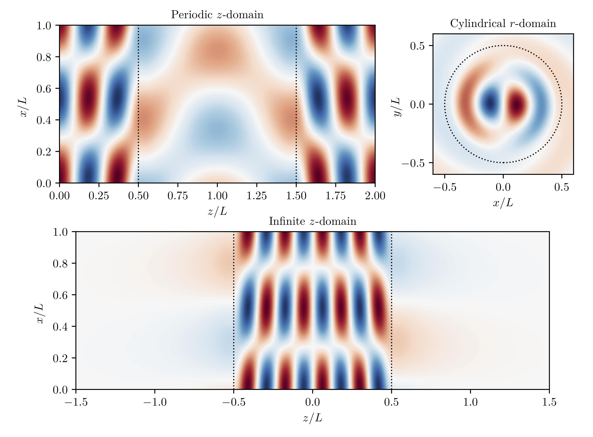
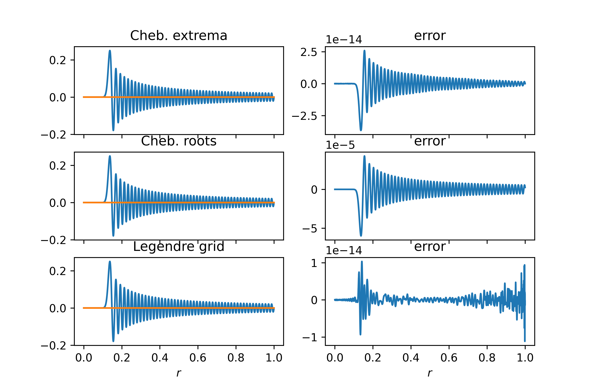
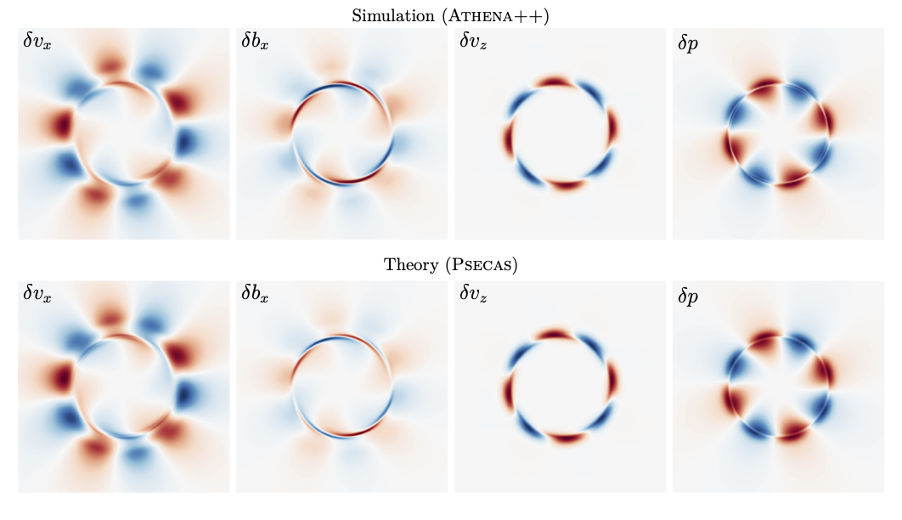
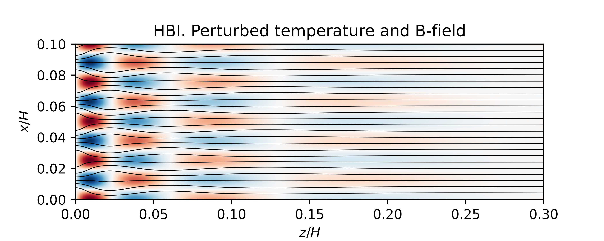

# Examples and gallery

Here we provide examples of using Psecas to solve linear eigenvalue
problems in astrophysical fluid dynamics. In addition, we include
examples found in the book by Boyd.

Below we show images from calculations performed with Psecas.
More figures can be generated by running the python scripts
contained in this folder.

<!-- http://felixhayashi.github.io/ReadmeGalleryCreatorForGitHub/ -->

### Hydrodynamic KHI in three different geometries

Pressure perturbation for the supersonic, hydrodynamic Kelvin-Helmholtz instability in Cartesian and cylindrical geometry. Figures from  Berlok, T. & Pfrommer, C. (2019). *On the Kelvin-Helmholtz instability with
smooth initial conditions – Linear theory and simulations*,
[MNRAS, 485, 908](https://academic.oup.com/mnras/advance-article-abstract/doi/10.1093/mnras/stz379/5308845).

### Solutions to spherical Bessel equation with three different grids

We solve the spherical Bessel equation

    r² d²f/dr² + 2 r df/dr +(κ²r² - l(l+1)) f = 0 ,

using three different grids. The problem is taken from the paper [*Tensor calculus in spherical coordinates using Jacobi polynomials Part-II: Implementation and Examples*](https://arxiv.org/pdf/1804.09283.pdf)
by Daniel Lecoanet, Geoff Vasil, Keaton Burns, Ben Brown and Jeff Oishi,
and this figure can be compared with their Figure 2.
More details are given in the python script (`grid-comparisons/bessel.py`).

### Unstable eigenmodes of a magnetized stream
Supersonic Kelvin-Helmholtz instability in a magnetized stream. Figures from
 Berlok, T. & Pfrommer, C. (2019). *The impact of magnetic fields on cold streams feeding galaxies*,
 [MNRAS, 489, 3368](https://academic.oup.com/mnras/advance-article-abstract/doi/10.1093/mnras/stz2347/5554001).
</img> </img>

### Galaxy cluster instabilities

#### Heat-flux-driven buoyancy instability
Here we show a linear solution obtained with Psecas for the heat-flux-driven buoyancy instability (HBI) in a quasi-global setup, i.e. periodic in x and non-periodic in z.
This problem was originally presented in H. N. Latter, M. W. Kunz, 2012, MNRAS,
423, 1964 [*The HBI in a quasi-global model of the intracluster medium.*](https://ui.adsabs.harvard.edu/abs/2012MNRAS.423.1964L/abstract)
The top figure shows temperature perturbations and changes in magnetic field
line structure. The bottom figure shows the mode structure obtained by Psecas.
One can compare these figures with figure 3 in the paper by Latter & Kunz.

</img>

#### Magneto-thermal instability
Psecas has been used to obtain quasi-global solutions for the magneto-thermal instability.
Here we show temperature variationas and perturbed magnetic field lines
(left) and the eigenmode structure (right). More details in the paper
[*Suppressed heat conductivity in the intracluster medium:
implications for the magneto-thermal instability*](https://arxiv.org/abs/2007.00018)
by Thomas Berlok, Eliot Quataert, Martin E. Pessah & Christoph Pfrommer.

</img></img>

## Hall-MRI in accretion disks

We can use Psecas to obtain global eigenmodes for the non-ideal (ohmic and Hall diffusion) MRI in a cylindrical unstratified differentially rotating system.
Details about this calculation can be found in a paper by
[Leonardo Krapp, Oliver Gressel, Pablo Benítez-Llambay, Turlough P. Downes, Gopakumar Mohandas,
and Martin E. Pessah, (2018), ApJ, 865, 2,](https://doi.org/10.3847/1538-4357/aadcf0)

