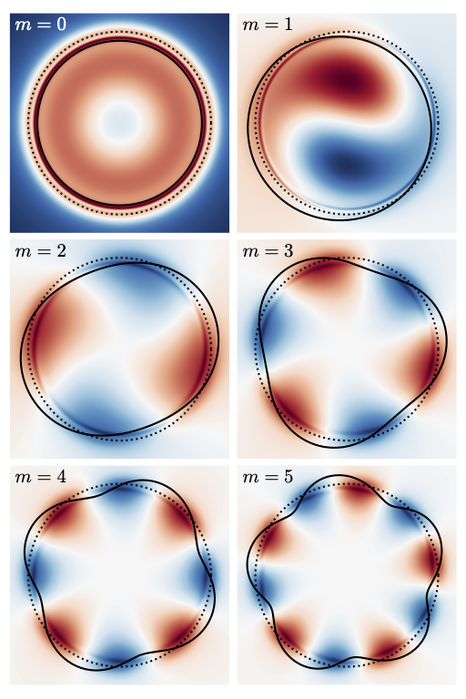
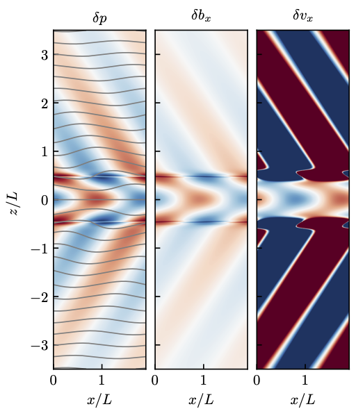

# Gallery

### Hydrodynamic KHI in three different geometries

Pressure perturbation for the supersonic Kelvin-Helmholtz instability in Cartesian and cylindrical geometry.

<!-- ### Solutions to Bessel's ODE with three different grids -->

### Unstable eigenmodes of a magnetized stream

